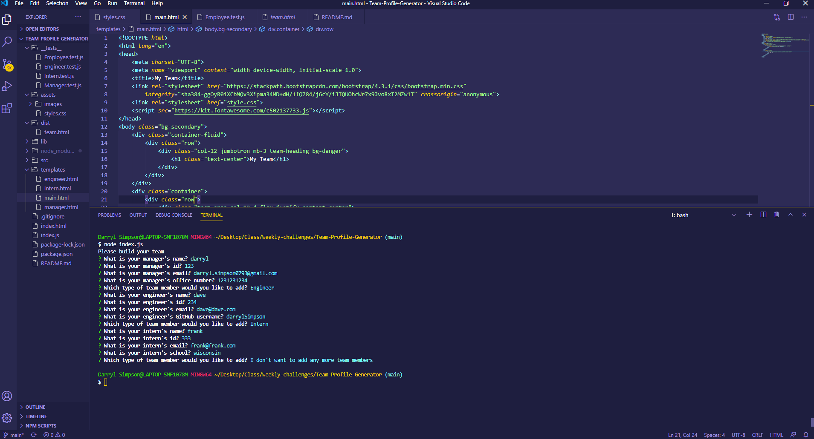
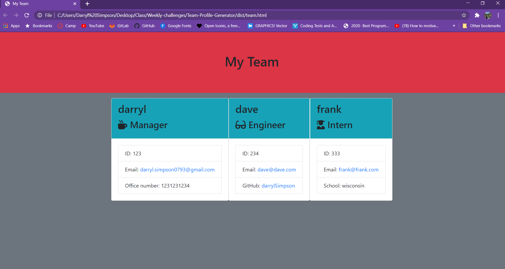

# Team-Profile-Generator!

* AS A manager
* I WANT to generate a webpage that displays my team's basic info
* SO THAT I have quick access to their emails and GitHub profiles

# Table of Contents

 Table of contents

 * [About the Project](#About-The-Project)
    * [Built With](#built-with)

* [Usage](#usage)
    * [Pictures](#pictures)

* [Link to Page](#link-to-page)

* [Contact](#contact)
    * [Creators](#creator)

# About The Project

* GIVEN a command-line application that accepts user input
* WHEN prompted for team members and their information
* THEN an HTML file is generated that displays a nicely formatted team roster based on user input
* WHEN user click's on an email address in the HTML
* THEN user's default email program opens and populates the TO field of the email with the address
* WHEN user click's on the GitHub username
* THEN that GitHub profile opens in a new tab
* WHEN you start the application
* THEN you are prompted to enter the team manager’s name, employee ID, email address, and office number
* WHEN you enter the team manager’s name, employee ID, email address, and office number
* THEN you are presented with a menu with the option to add an engineer or an intern or to finish building my team
* WHEN you select the engineer option
* THEN you are prompted to enter the engineer’s name, ID, email, and GitHub username, and then taken back to the menu
* WHEN you select the intern option
* THEN you are prompted to enter the intern’s name, ID, email, and school, and then taken back to the menu
* WHEN you decide to finish building my team
* THEN you exit the application, and the HTML is generated

## Built With
 * HTML
 * JavaScript
 * [Node](https://nodejs.org/en/)

# Usage

## Video Instructions (click)

## Pictures

# Link to Page

* [Follow this Link to page](https://darrylsimpson.github.io/Team-Profile-Generator/)

# Contact

## Creator

* [Check out my GitHub](https://github.com/DarrylSimpson) , or email me at [Darryl.Simpson0793@gmail.com](mailto:Darryl.Simpson0793@gmail.com)

